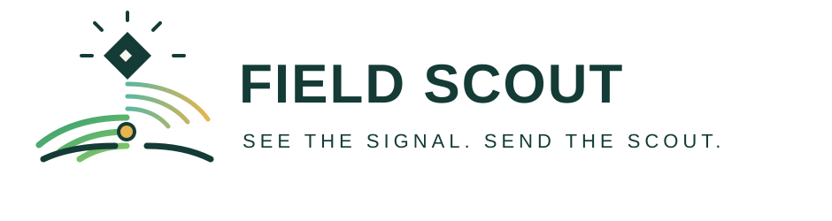
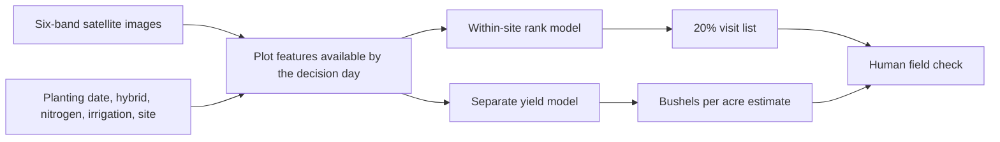

# Field Scout



**A visit list for maize research plots, built from satellite images and field records.**

A crop team has more plots than it can inspect in one week. Field Scout ranks plots for a human visit. It also shows a separate grain-yield estimate. The team can see which image informed each plot and when that image was taken.

## The result shown in our IoT4Ag demo

| Decision check | Field records | Field records + six-band image indices |
|---|---:|---:|
| Low-yield plots found with a 20% visit list, 90 days after planting | 51.5% | **53.4%** |
| Yield mean absolute error at 90 days, bushels per acre | 19.29 | **17.11** |

The scouting result uses 10 overlapping whole-block test splits. The yield result uses 7 separate splits. Both use 2,131 plots at five known 2022 sites. The image gain varies by site. It does not prove better field outcomes or performance in a new season. See [results and source score tables](docs/RESULTS.md).

## From images to a visit list



The six image bands are red, green, blue, near-infrared, red edge, and deep blue. The model uses image dates for each site. It never treats a shared time-point label as a shared calendar date.

## What is in this repo

- [Method](docs/METHOD.md): image features, block splits, and score rules.
- [Results](docs/RESULTS.md): slide figures, site changes, limits, and score tables.
- [Data guide](docs/DATA.md): source links, units, coverage, and required local tables.
- [Demo guide](docs/DEMO.md): the five-slide story and app replay steps.
- [`src/scout/`](src/scout): data checks, feature extraction, rank and yield models.
- [Scouting app](app/scouting.py): a historical visit-list replay.
- [`evidence/`](evidence): aggregate and split-level scores used in the demo. These files contain no plot records.

The PowerPoint deck, raw images, plot records, and model runs are local files. They are not in GitHub.

## Run the code

Use Python 3.12 and the Box source data. Place the organized source files and prepared index tables under `data/` as [the data guide](docs/DATA.md) shows. Then run:

```sh
python3.12 -m venv .venv
source .venv/bin/activate
python -m pip install -r requirements-lock.txt
python -m pip install --no-deps -e .
scout audit
scout features --season 2022
scout evaluate-rank-input-dap-split --dap 90 --seed 42 --output outputs/rank_dap90_seed42
scout evaluate-yield-dap-split --dap 90 --seed 42 --output outputs/yield_dap90_seed42
```

Each command writes a new local output folder. [The method](docs/METHOD.md) gives the full seed lists and the demo build steps. Raw data and prepared indexes are required to repeat the model runs. The public score tables let readers inspect the reported results without that data.

## Field use

The visit rule selects the first 20% of plots by rank at each site. This crew limit is our pilot choice, not a challenge rule. Low predicted yield can result from a planned hybrid or nitrogen treatment. A scout must inspect the plot before the team acts.

The next check is a one-week pilot. Compare **useful findings per scout-hour** against the usual route. The current data do not contain field findings or intervention outcomes.

## Data sources

- [IoT4Ag Box data: 2022 and limited 2023](https://ucmerced.app.box.com/s/z91y2t422jlcd1ieukrn7q2tdk3765kx)
- [Dryad 2022 archive](https://datadryad.org/dataset/doi:10.5061/dryad.905qftttm)
